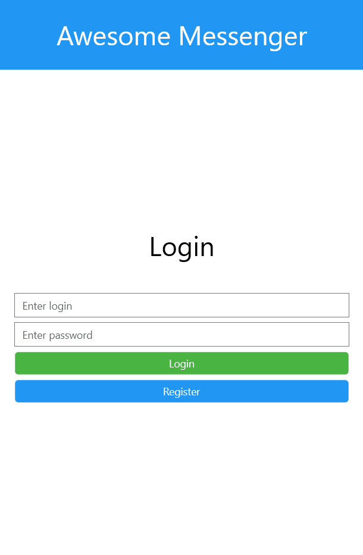

# AwesomeMessenger

**AwesomeMessenger** is a messenger with authorization and registration system created with Xamarin.

## How it run

* Start the server. There are several methods of how to do this:
  * Compile and run the server from the [creator's repository](https://github.com/gershuk/SimpleChatApp)
  * Compile and run the server from [this repository](https://github.com/ivanovskii/AwesomeMessenger/tree/main/AwesomeMessenger/AwesomeServer)
  * Run the compiled server from the [releases](https://github.com/ivanovskii/AwesomeMessenger/releases/download/v1.0.0/AwesomeServer-v1.0.0.0.zip)
* Press Enter twice to start the server on localhost
* Run UWP application in Visual Studio
